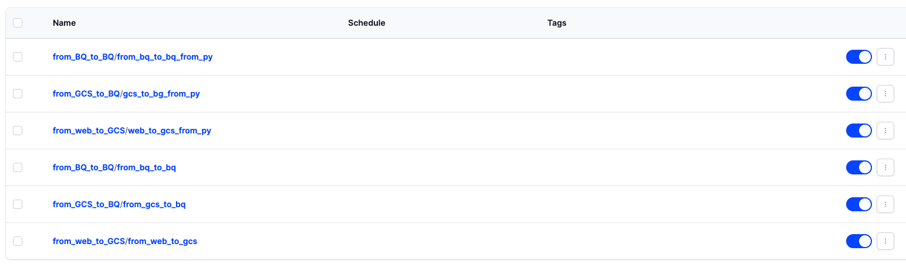

# LEGO Analytics


## Problem description
LEGO is a Danish toy production company over 90 years old, from 1932. With a large retail system overworld, stackholders need a nearly real-time dashboard to tracking the flow of products to insure that all toys are deliveried to the right person. 

Since the retailer system are spread all the world, we need an end-to-end automated pipeline to pull data from each store website, aggregate them into meaningful information to help stackholder to keep up with the status of each store and season, and the pipeline should update regular in day to make sure stackholder not missing any situation in each store.


## Technologies:
1. <span style="color:lightskyblue">G</span><span style="color:orangered">o</span><span style="color:gold">o</span><span style="color:lightskyblue">g</span><span style="color:yellowgreen">l</span><span style="color:orangered">e</span> Cloud Strorage as Datalake
2. <span style="color:lightskyblue">G</span><span style="color:orangered">o</span><span style="color:gold">o</span><span style="color:lightskyblue">g</span><span style="color:yellowgreen">l</span><span style="color:orangered">e</span> BigQuery as Data warehouse
3. <span style="color:lightskyblue">Looker (Data studio)</span> as Interactive Dashboard/report
4. <span style="color:cyan">Prefect</span> as Workflow Orchestration
5. <span style="color:magenta">Terraform</span> as Infrastructure as Code (IaC)
5. <span style="color:darkorange">Pyspark</span> as Batch Processing

## Project Architecture


- LEGO data is avaiable at [Rebrickable](https://rebrickable.com/downloads/)
- The whole process is orchestrated by Prefect and Docker.
- Data is download directly from website to Google Cloud bucket, it's also can download to local server (optional) for backup purpose.
- Then, the data will transfer from GC bucket to BQ by Prefect as well, this process will make sure we can access raw data in BQ.
- After that, Pyspark in Google Cloud Compute will pickup the data in BQ, perform transform and put clean and aggregate data as tabular data in BigQuery. Since the tranformation in big data can take a lot of time for some tools, so Pyspark can be used here to speedup the process.
- And final step, Looker (Data Studio) load the data from BigQuery to visualize it as charts
## Step-by-step

### Step 0: Clone this repository to you computer:
```bash
git clone git@github.com:LeVan146/DE2023.git
```
### Step 1: Install and setup enviroment
- Setup new project in GCP
    - [Start from 4:00 of this video](https://www.youtube.com/watch?v=Hajwnmj0xfQ&list=PL3MmuxUbc_hJed7dXYoJw8DoCuVHhGEQb&ab_channel=DataTalksClub%E2%AC%9B)

- Create Service Account and GCP key in Google Cloud by follow:
    - [Google cloud website](https://cloud.google.com/iam/docs/service-accounts-create#iam-service-accounts-create-console)
    - [Start from 27:00 of this video](https://www.youtube.com/watch?v=W-rMz_2GwqQ&list=PL3MmuxUbc_hJed7dXYoJw8DoCuVHhGEQb&index=20&ab_channel=DataTalksClub%E2%AC%9B)

- Download Service Account key as json file for future connection in Prefect and use Terraform to create infrastructure in Google Cloud

- Create docker image in [Docker hub](hub.docker.com)
    - You can follow [this official tutorial](https://docs.docker.com/docker-hub/repos/)
    - You can use (levan146/prefect:van_de23)[https://hub.docker.com/r/levan146/prefect] (my image to run the code)
    - If you use your image, please change the docker name in all thing related to docker.

- Build docker block in Prefect
    - [Start from 11:00 of this video](https://www.youtube.com/watch?v=psNSzqTsi-s&list=PL3MmuxUbc_hJed7dXYoJw8DoCuVHhGEQb&index=23&ab_channel=DataTalksClub%E2%AC%9B)


- Connect Prefect with Google Cloud Bucket
    - [Start from 24:00 of this video](https://www.youtube.com/watch?v=W-rMz_2GwqQ&list=PL3MmuxUbc_hJed7dXYoJw8DoCuVHhGEQb&index=20&ab_channel=DataTalksClub%E2%AC%9B)


### Step 2: Create GCP resources with Terraform:
With Terraform, we can create GCP resources with config file, rather than manually process.

Go to Terraform folder with `cd terraform`, then we init Terraform with:
```bash
terraform init
```

Double check the config with:
```bash
terraform plan \
    -var="project_name=your_gcp_project_id" \
    -var="region=your_region" \
    -var="bucket_name=your_gcs_bucket_name" \
    -var="storage_class=your_storage_class" \
    -var="bq_dataset_name=your_bq_dataset_name" \
```

After double check everything, we apply the configuration for your project with:
```bash
terraform apply \
    -var="project_name=your_gcp_project_id" \
    -var="region=your_region" \
    -var="bucket_name=your_gcs_bucket_name" \
    -var="storage_class=your_storage_class" \
    -var="bq_dataset_name=your_bq_dataset_name"
```

### Step 3: Start and deploy code with Prefect


- Start Prefect GUI: 
```bash
prefect orion start
```

- Open Prefect UI at: http://127.0.0.1:4200/deployments

- Start Prefect agent first, then it will run the job when we need it:
```bash
prefect agent start -q default
```

You can pick only step 3.1 or step 3.2, or both of them.
#### Step 3.1: Start and deploy code with Prefect and CLI

- Deploy code `download data from website to bucket in GCP`:
    ```bash
    prefect deployment build source/from_web_to_gcs.py:from_web_to_gcs -n "from_web_to_gcs"
    ```

    Replace `parameters` in file `from_web_to_gcs-deployment.yaml` with:
    ```bash
    parameters: {
    "urls": [
        "https://cdn.rebrickable.com/media/downloads/inventory_sets.csv.gz?1682147607.450634", 
        "https://cdn.rebrickable.com/media/downloads/sets.csv.gz?1682147600.4386284", 
        "https://cdn.rebrickable.com/media/downloads/themes.csv.gz?1683011566.062824"
    ],
    "data_names": [
        "inventory_sets", 
        "sets", 
        "themes"
    ]
    }
    ```

    Apply the config:
    ```bash
    prefect deployment apply from_web_to_gcs-deployment.yaml
    ```

- Deploy code `transfer data from GCP bucket (GCS) in BQ`:
    ```bash
    prefect deployment build source/from_gcs_to_bq.py:from_gcs_to_bg -n "from_gcs_to_bq"
    ```

    Replace `parameters` in file `from_gcs_to_bg-deployment.yaml` with
    ```bash
    parameters: {
    "data_names": [
        "inventory_sets", 
        "sets", 
        "themes"
    ]
    }
    ```

    Apply the config:
    ```bash
    prefect deployment apply from_gcs_to_bg-deployment.yaml  
    ```

- Deploy code `transfer data from BQ in BQ`:
    ```bash
    prefect deployment build source/spark_job.py:from_bq_to_bq -n "from_bq_to_bq"
    ```

    Replace `parameters` in file `from_bq_to_bq-deployment.yaml` with
    ```bash
    parameters: {
    "data_names": [
        "inventory_sets", 
        "sets", 
        "themes"
    ]
    }
    ```

    Apply the config:
    ```bash
    prefect deployment apply from_bq_to_bq-deployment.yaml  
    ```

#### Step 3.2: Start and deploy code with Prefect/Docker and python 
Build image docker:
```bash
docker image build --no-cache -t levan146/prefect:van_de23 .
```

Push image to docker:
```bash
docker image push levan146/prefect:van_de23
```

Deploy 3 jobs from python:
```bash
python source/docker_deploy.py
```
If you see 6 deployments here Prefect, it's means your deployment process is correct. I just add `_from_py` at the end of the name to make sure manual and auto deployment are seperated, so we can check both of step 3.1 and 3.2 is correct or not.


## Step 4: Run job 
Run manually 3 processes: \
Run the process to download data from website to GC bucket:
```bash
prefect deployment run from_web_to_GCS/from_web_to_gcs
```

Run the process to load data from GC bucket to BQ:
```bash
prefect deployment run from_GCS_to_BQ/from_gcs_to_bq
```

Run the process to transform data from BQ to BQ:
```bash
prefect deployment run from_BQ_to_BQ/from_bq_to_bq
```

Or you can go to Prefect GUI, setup `chron` and make its run daily.

Now you can check your table in BigQuery, the correct result should belike 2 following images:

  

## Dashboard


- My dashboard available at [link](https://lookerstudio.google.com/reporting/a6bdfbe6-3bf5-4e65-a500-381e91d70d1c)

- For the chart in bottom left, as you can see 2003, the number of LEGO set decreate caused by (Great Recession)[https://en.wikipedia.org/wiki/Great_Recession], and it happend again in 2023. Despite the peak of LEGO in 2022. Due to the COVID, everyone need to stay at home, so they buy more LEGO to make them enjoy the long time inside their house.

- Move to the Most popular set chart, the Minifigures theme dominated top 10 of the table, I think the reason here because everyone want to have the LEGO collection, but others themes are out of their budget, so the Minifigures become their top choose. And 1 more reason like small LEGO size, we can decorate it all the place we want.
## Planning
- [x] Use Terraform as IaC
- [x] Download data from url to GCS (as datalake) with Prefect
- [x] Load data from GCS to BigQuery (as datawarehouse) with Prefect
- [x] Transform and create table with partition/cluster in BQ with Pyspark in GCP
- [x] Parameterize upload_to_GCS code
- [x] Schedules & Docker Storage with Prefect
- [x] Create dashboard in Looker with data from BigQuery

## Reviewing criteria  
- Problem description – *The problem statement and project description is defined [here](#problem-description).*  \
[] 0 points: Problem is not described \
[] 1 point: Problem is described but shortly or not clearly \
[x] 2 points: Problem is well described and it's clear what the problem the project solves    
- Cloud – *<span style="color:lightskyblue">G</span><span style="color:orangered">o</span><span style="color:gold">o</span><span style="color:lightskyblue">g</span><span style="color:yellowgreen">l</span><span style="color:orangered">e</span> cloud is used for data lake/warehouse and <span style="color:magenta">Terraform</span> as IaC.* \
[] 0 points: Cloud is not used, things run only locally \
[] 2 points: The project is developed in the cloud \
[x] 4 points: The project is developed in the cloud and IaC tools are used  
- Data ingestion (choose either batch or stream) - Batch / Workflow orchestration – *Batch processing of end-to-end pipeline with tasks/flows defined in <span style="color:darkorange">Pyspark</span> and using orchestration on <span style="color:cyan">Prefect</span>.* \
[] 0 points: No workflow orchestration \
[] 2 points: Partial workflow orchestration: some steps are orchestrated, some run manually \
[x] 4 points: End-to-end pipeline: multiple steps in the DAG, uploading data to data lake
- Data warehouse – *<span style="color:lightskyblue">BigQuery</span> used to store transformed table. Each final table have partition by date and cluster by theme id * \
<sub> The partition and cluster here is for demonstration </sub> \
[] 0 points: No DWH is used \
[] 2 points: Tables are created in DWH, but not optimized \
[x] 4 points: Tables are partitioned and clustered in a way that makes sense for the upstream queries (with explanation)
- Transformations (dbt, spark, etc) – *<span style="color:darkorange">Pyspark</span> is used for data transformations.* \
[] 0 points: No transformations \
[] 2 points: Simple SQL transformation (no dbt or similar tools) \
[x] 4 points: Transformations are defined with dbt, Spark or similar technologies
- Dashboard – *Dashboard is created with <span style="color:lightskyblue">Looker (Data studio)</span>. 3 charts/tiles created.* \
[] 0 points: No dashboard \
[] 2 points: A dashboard with 1 tile \
[x] 4 points: A dashboard with 2 tiles 
- Reproducibility – *Instructions are write indetail, include example. Each step contain step-by-step to follow* \
[] 0 points: No instructions how to run code at all \
[] 2 points: Some instructions are there, but they are not complete \
[x] 4 points: Instructions are clear, it's easy to run the code, and the code works

